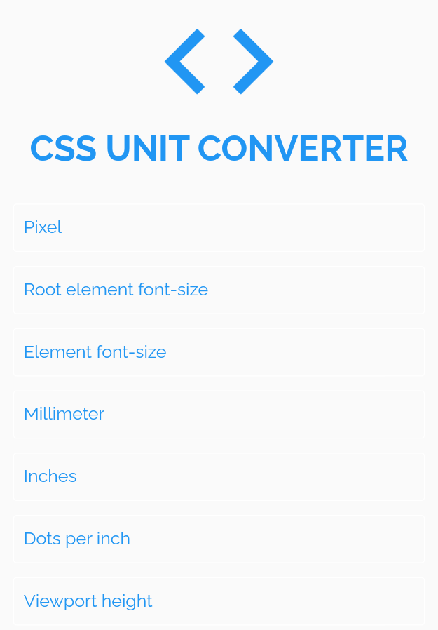
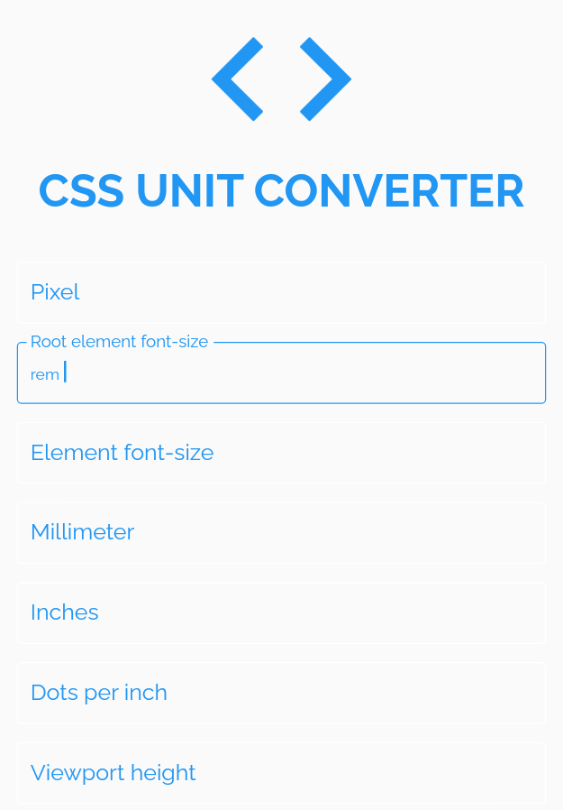
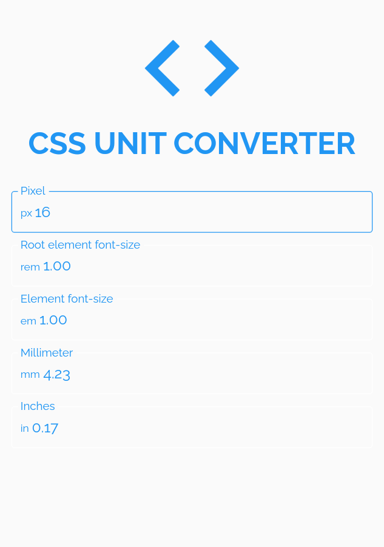
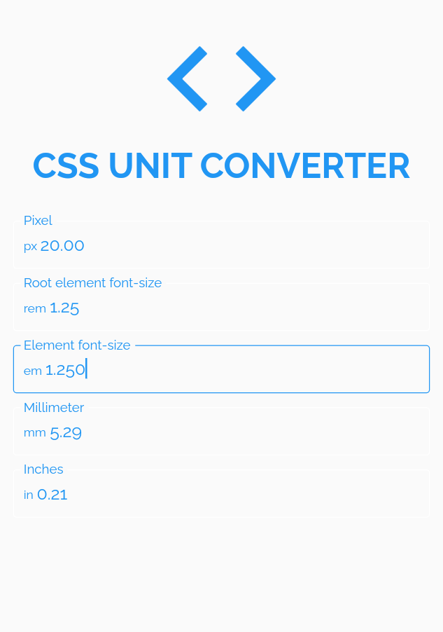

# 👨‍💻 CSS UNIT CONVERTER

Aplicação Mobile em Flutter - Calculadora de Unidades de Medida CSS.

## ⚙️ Informações adicionais

- Flutter: v. 2.5.1
- Dart: v. 2.14.2
- Fonte: Raleway Regular e Raleway Bold

## 🖼️ Imagens

  
  

  
  

